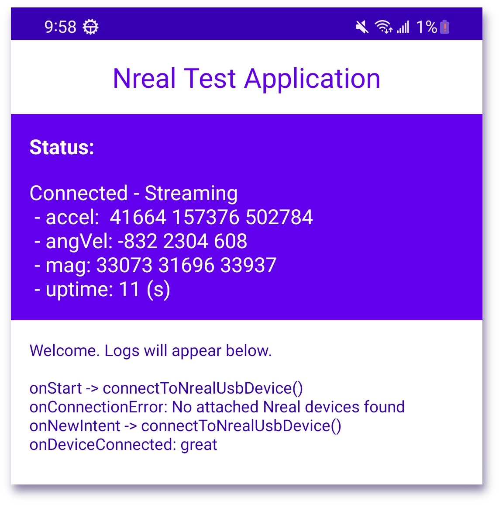

# Android-Nreal 🕶️📱

Welcome to the Android-Nreal project! 🎉👋 This open-source Android library is designed to
communicate with Nreal Air AR glasses. Our goal is to provide a convenient,
efficient, easy to understand, and dependency-free library for developers to create AR
experiences on the Nreal platform.

## 🌟 Features

- [x] Auto-detection and hot-plug detection
- [x] Communication and IMU packet decode
- [x] Key press decoding (brightness up/down, power)
- [ ] Sensor fusion
- [ ] Rendering
- [ ] [Nreal Light](https://www.nreal.ai/light/) support
- [ ] Per-eye display (3D spatial rendering for your Java/OpenGL apps)
- [ ] Standalone library with demos

We're far from done, and your pull requests would be greatly appreciated! 🤝

## 📚 What is this?

The library aims to discover, open, read, and decode the IMU messages from Nreal Air AR glasses. It
provides easy-to-use 3DoF coordinates for viewport rendering. In the future, we plan to support
dual-eye rendering, 6DoF, and camera/microphone input. If this project pushes Nreal to broaden
the SDK to the Android platform, that would also be a huge win for the community!

## 🚀 How to Build and Run

You can easily build and run this project on your own unrooted Android devices. Here are the steps:

1. Clone the repository: `git clone https://github.com/enricoros/android-nreal.git`
2. Open the project with Android Studio 2022.3.1 or later.
3. Connect your Android device to your computer (targeting API 30, but it can be easily relaxed)
4. Click the "Run" button (▶️) in Android Studio

## 🙌 Special Thanks

We would like to thank the following members of the Nreal Community Discord for their initial code
and help:

- ***@edwatt*** - Github: [edwatt/imu-inspector](https://github.com/edwatt/imu-inspector)
- ***@MattXer*** - Github: [MSmithDev/AirAPI_Windows](https://github.com/MSmithDev/AirAPI_Windows)
- ***@Noot*** - Github: [abls/imu-inspector](https://github.com/abls/imu-inspector)

Thank you for your invaluable contributions! 🏆

## 💡 Contributing

If you're interested in contributing to this project, please clone, fork, slash, and burn the code,
and then send me a pull request! By working together, we can create a more comprehensive and robust
library for the Nreal developer community 🚀🌟
